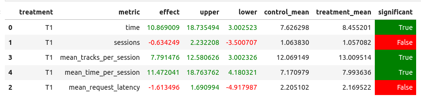

## Аннотация

Модель - ансамбль моделей SasRec и Bert4Rec. На тренировочном датасете независимо обучаются обе модели для i2i рекомендаций, после чего их ответы объединяются в новый топ-10 рекомендаций с подобранными весами.

## Детали

Модели обучаются на датасете, собранном на основе запуска эксперимента SasRec vs HSTU, представленном в репозитории авторами курса. Датасет дополняется информацией о треках: именем исполнителя, жанрами исполнителя и трека, настроении и годе выпуска трека. 

На нем обучаются обе модели. Sasrec в течение 100 эпох, Bert4Rec - в течение 200, как более сложная модель. Ответы моделей взвешиваются (Sasrec с весом 0.4) и комбинируются в новый топ-10 рекомендаций. Для корректного сравнения скоров двух разных моделей, скоры переводятся в "вероятности" с помощью softmax.

## Результаты A/B эксперимента

Как можно видеть в табличке, время прослушивания трека статзначимо увеличилось $\tilde 11%$. Также увеличились среднее время трека $\tilde 11%$) и среднее количество треков в сессии ($\tilde 8%$).
